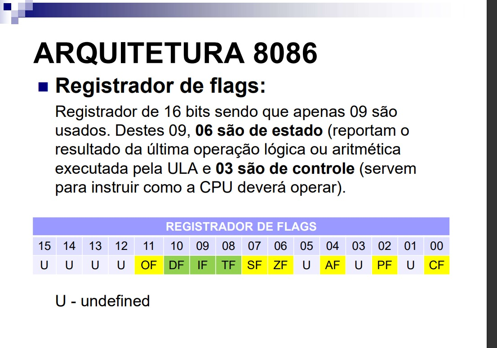
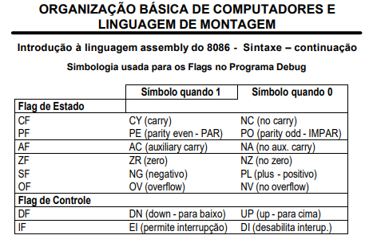
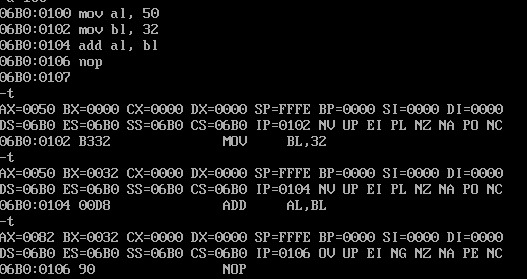

# Registradores-de-flag

<h3>Atividade</h3>

<h3>Representação das flags:</h3>

<h3>Código exemplo:</h3>

<h3>Referências</h3>
[Exemplo de operações com registradores parte 1](https://www.youtube.com/watch?v=CfVj3Iip4q4)
 
[Exemplo de operações com registradores parte 2](https://www.youtube.com/watch?v=L5-YG6MYs5w&t=1967s)
