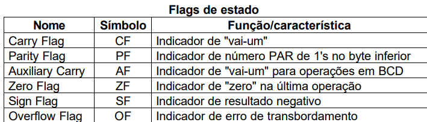

# Registradores-de-flag

<h3>Atividade</h3>
 

 

<h3>Flags </h3>
Flags são registradores onde cada bit significa um estado do processador. São eles: 

CF = Carry  
PF = Parity  
AF = Auxiliar Carry  
ZF = Zero  
SF = Signal  
TF = Trap  
IF = Interrupt Enable Flag  
DF = Direction  
OF = OverFlow  
Das flags citadas acima, 6 são de estado:  

<h3>Representação das flags:</h3>

 

 

<h3>Código exemplo:</h3>

 

 

MOV AL, 50 (50 = 01010000 positivo) 
MOV BL, 32 (32 = 00110010 positivo) 
ADD AL, BL (82 = 10000010 negativo) 

 

<h3>Referências</h3>

[Exemplo de operações com registradores parte 1](https://www.youtube.com/watch?v=CfVj3Iip4q4)

 

[Exemplo de operações com registradores parte 2](https://www.youtube.com/watch?v=L5-YG6MYs5w&t=1967s)

 

[Exemplo de operações com registradores parte 3](https://www.geeksforgeeks.org/flag-register-8086-microprocessor/)
